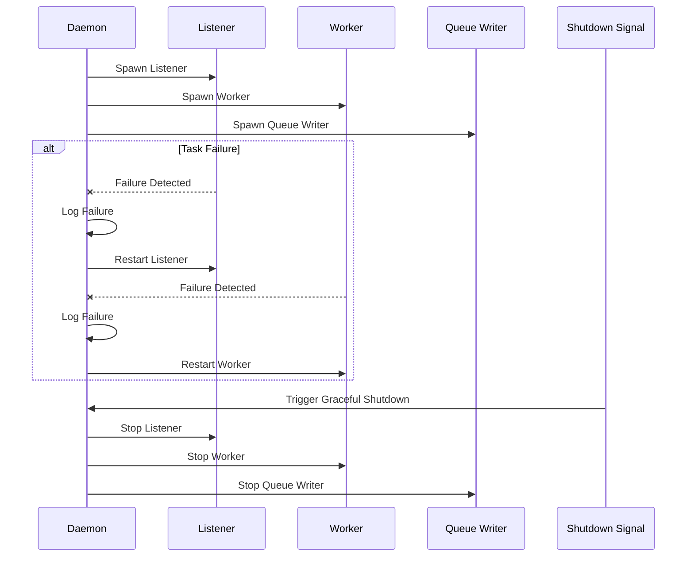
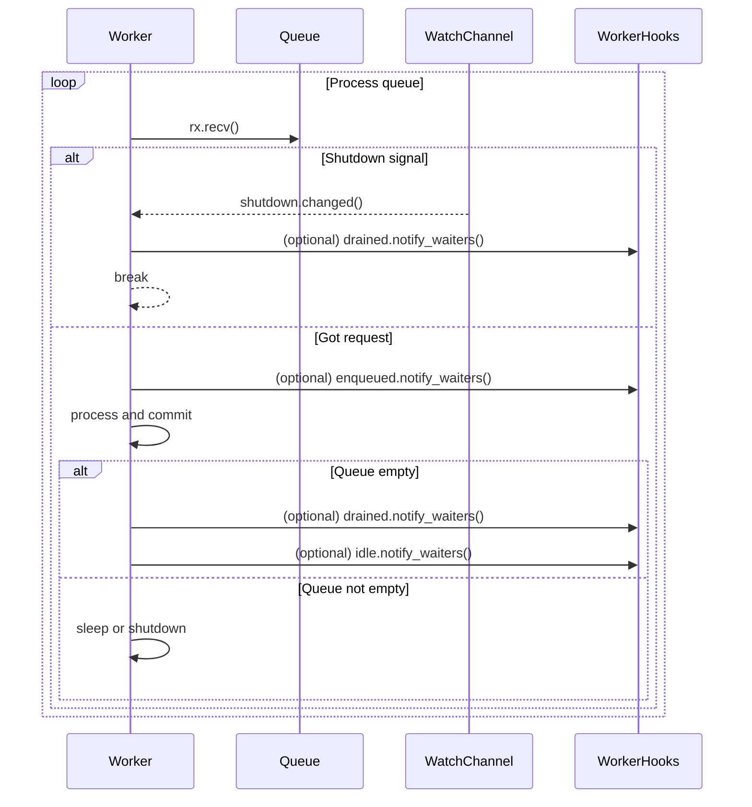

# A Fault-Tolerant GitHub Comment Queuing Service in Rust

## Section 1: System Architecture and Core Component Selection

This document presents a comprehensive architectural design and implementation
guide for `comenq`, a robust service for enqueuing GitHub Pull Request
comments. The system is designed to post comments with a mandatory cooling-off
period, a critical feature for managing interactions with GitHub's API and
avoiding secondary rate limits that penalize rapid, automated actions. The
design prioritizes reliability, security, and operational simplicity, tailored
for deployment on a resource-constrained Linux environment.

### 1.1. Architectural Overview: The Client-Daemon Model

The fundamental architecture of the `comenq` system is based on the classic
Unix client-daemon model. This design pattern is not merely a stylistic choice
but a direct and necessary consequence of the core requirement to enforce a
time-delayed, sequential processing of comments. A simple, ephemeral script
cannot maintain the state and persistence required for this task. The system is
therefore decomposed into two distinct, cooperating processes:

1. `comenqd` **(The Daemon):** A long-running background process that serves as
   the system's engine. It is solely responsible for managing a persistent job
   queue, interacting with the GitHub API, and enforcing the 16-minute
   cooling-off period between posts.

2. `comenq` **(The Client):** A lightweight command-line interface (CLI) tool.
   Its only function is to parse user input, connect to the `comenqd` daemon,
   and submit a new comment request for queuing.

This separation of concerns, inspired by established systems like Docker which
use a daemon-client model over a Unix socket[^1], yields significant advantages:

- **Persistence and Statefulness:** The daemon can maintain the queue and its
  internal timer state across many client invocations, ensuring that the
  16-minute delay is consistently enforced.

- **Decoupling:** The user's interaction (via the CLI) is immediate. The user
  can submit a comment and receive confirmation that it has been enqueued
  without having to wait for it to be posted. The daemon handles the
  asynchronous processing in the background.

- **Robustness:** The daemon can be managed as a proper system service, with
  automatic restarts on failure, while the client remains a simple, stateless
  utility.

The complete lifecycle of a request is illustrated in the following sequence:

1. A user on the host machine invokes the `comenq` client via a command like
   `ssh mybox comenq owner/repo 123 "My comment"`.

2. The `comenq` client parses the command-line arguments.

3. The client establishes a connection to the `comenqd` daemon over a local
   Unix Domain Socket (UDS).

4. The client serializes the comment data into a predefined format (JSON) and
   transmits it to the daemon.

5. The `comenqd` daemon, listening on the UDS, accepts the connection, reads
   the data, and deserializes it into a job request.

6. The daemon validates the request and pushes it onto a persistent,
   disk-backed queue.

7. The daemon immediately sends an acknowledgment of receipt back to the
   client, which then exits.

8. A separate, dedicated worker task within the daemon continuously monitors
   the queue. It dequeues one job at a time.

9. The worker task uses an authenticated client to post the comment to the
   GitHub API.

10. Upon successful posting, the worker commits the job, permanently removing
   it from the queue.

11. The worker task then enters a 16-minute sleep state (the "cooling-off
   period").

12. After the sleep period elapses, the worker task returns to step 8, ready to
   process the next job in the queue.

This architecture ensures that comment posting is strictly serialized and
paced, directly addressing the primary goal of avoiding API rate limits.

### 1.2. Core Technology Stack: Crate Selection and Justification

The selection of foundational Rust libraries (crates) is critical to building a
robust and maintainable system. The following table outlines the chosen crates
for each major component of the `comenq` service, along with a detailed
justification for each selection based on an analysis of available tools and
project requirements.

<!-- markdownlint-disable MD013 -->
| Component/Concern | Selected Crate/Library | Key Features & Rationale | Alternative(s) Considered |
| -------------------- | ---------------------------- | --------------------------------------------------------------------------------------------------------------------------------------------------------------------------------------------------------------------------------------------------------------------------------------------------------------------------------------------------------------------- | ------------------------------------------------------------------------------------------------------------------------------------------------------------------------------------------------------------------------------------------------------------------------------ | -------------------- | ---------- |
| Asynchronous Runtime | tokio | The de-facto standard for asynchronous programming in Rust. It provides a high-performance, multithreaded scheduler and a comprehensive suite of utilities for I/O, networking, and timers, including the essential UnixListener, UnixStream, and time::sleep components.[^2] Its maturity and extensive ecosystem make it the definitive choice for the daemon's core. | async-std |
| CLI Argument Parsing | clap | The most popular and feature-rich CLI argument parsing library for Rust.[^3] The | derive feature offers an exceptionally ergonomic and declarative way to define the CLI's structure, automatically generating argument parsing, validation, and help text from a simple struct definition.[^3] | argh, pico-args 4 |
| GitHub API Client | octocrab | A modern, actively maintained, and extensible GitHub API client.[^5] It provides strongly typed models for API responses and a builder pattern for requests, simplifying interaction with the GitHub REST API. Its static API and support for custom middleware are valuable for building robust clients.[^3] | roctokit 12, manual | reqwest 13 |
| Persistent Queue | yaque | A disk-backed, persistent queue designed for asynchronous environments.[^7] Its most critical feature is | transactional reads via its RecvGuard mechanism. This ensures that a dequeued item is automatically returned to the queue if the program panics or fails before the item is explicitly committed, providing an "at-least-once" delivery guarantee essential for reliability.[^7] | queue-file 16, | v_queue 18 |
| IPC Serialization | serde / serde_json | serde is the universal framework for serialization and deserialization in Rust. serde_json provides a straightforward implementation for the JSON data format, which is chosen for its human-readability (aiding in debugging) and widespread support. | bincode, prost |
| Systemd Integration | systemd (crate) | Provides native Rust bindings for interacting with the systemd journal and daemon notification APIs.[^8] While the primary deployment mechanism is a | .service file, this crate can be used for more advanced integration, such as sending readiness notifications. | systemctl (crate) 20 |
| Logging | tracing / tracing-subscriber | A modern, structured, and asynchronous-aware logging and diagnostics framework. It is the standard choice for tokio-based applications, providing contextual information that is superior to traditional line-based logging. | log / env_logger 22 |
| |
<!-- markdownlint-enable MD013 -->

## Section 2: Design of the `comenq` CLI Client

The `comenq` client is designed to be a simple, robust, and user-friendly tool.
Its sole responsibility is to capture the user's intent from the command line
and relay it securely to the `comenqd` daemon. The implementation will leverage
`clap` for argument parsing and `tokio` for asynchronous communication over the
Unix Domain Socket.

### 2.1. Defining the Command-Line Interface with `clap`

The command-line interface is the primary point of interaction for the user. A
well-designed CLI is intuitive and self-documenting. The `clap` `derive` macro
defines the entire CLI structure declaratively within a Rust `struct`,
providing clarity and maintainability compared to the more verbose builder
pattern.[^3]

The CLI will accept three required positional arguments, matching the user's
requested invocation format: `comenq <owner/repo> <pr_number> <comment_body>`.

The following code defines the `Args` struct that represents the CLI. This will
be the core of the `comenq` client's `main.rs`.

```rust
// In src/bin/comenq/main.rs

use clap::Parser;
use std::path::PathBuf;

/// A CLI client to enqueue a comment for a GitHub Pull Request.
#
#
pub struct Args {
    /// The repository in 'owner/repo' format (e.g., "rust-lang/rust").
    #
    repo_slug: String,

    /// The pull request number to comment on.
    #
    pr_number: u64,

    /// The body of the comment. It is recommended to quote this argument.
    #
    comment_body: String,

    /// Path to the daemon's Unix Domain Socket.
    #
    socket: PathBuf,
}
```

The `#[derive(Parser)]` attribute instructs `clap` to generate all the
necessary parsing logic.[^5] The doc comments (

`///`) are automatically converted into help messages, which are displayed when
the user runs `comenq --help`. This feature makes the tool
self-documenting.[^10] The

`#[arg(...)]` attributes provide fine-grained control over each argument, such
as defining a `default_value` for the socket path, making the client flexible
for different environments. The optional `--socket` flag overrides this path
when specified, giving users a simple way to adapt to custom deployments.[^3]

### 2.2. Client-Daemon IPC Protocol

Effective communication between the client and daemon requires a clearly
defined data contract. This ensures that both components have a shared
understanding of the information being exchanged.

#### 2.2.1. The `CommentRequest` Data Structure

A shared `CommentRequest` struct will serve as the message format. To be used
by both the client and the daemon, this struct will reside in a shared library
crate (e.g., `comenq-lib`). It must be serializable, so it will derive
`serde::Serialize` for the client to encode it and `serde::Deserialize` for the
daemon to decode it.

```rust
// In src/lib.rs (or a dedicated lib crate)

use serde::{Serialize, Deserialize};

/// The data structure sent from the client to the daemon over the UDS.
/// It contains all necessary information to post a GitHub comment.
#
pub struct CommentRequest {
    pub owner: String,
    pub repo: String,
    pub pr_number: u64,
    pub body: String,
}
```

#### 2.2.2. Serialization and Transport

The client will serialize the `CommentRequest` instance into a JSON string
using the `serde_json` crate. JSON is selected for this purpose due to its
excellent debugging characteristics (it is human-readable) and its robust,
widespread support within the Rust ecosystem.

The serialized JSON data will be sent over a `tokio::net::UnixStream`. The
choice of a Unix Domain Socket (UDS) is deliberate and carries significant
advantages for this application:

- **Performance:** For local Inter-Process Communication (IPC), UDS bypasses
  much of the TCP/IP stack overhead, resulting in lower latency and higher
  throughput.

- **Security:** This is the most critical advantage. A UDS is an entity in the
  filesystem, like a file.[^12] This means it is subject to standard Unix
  filesystem permissions (

  `chmod`, `chown`). The `comenqd` daemon can create the socket with
  permissions that restrict write access to a specific user or group. This
  provides a simple, powerful, and OS-integrated security model, preventing
  unauthorized local users or processes from injecting comments into the queue.
  This is inherently more secure than a `localhost` TCP socket, which any local
  user could connect to by default.

### 2.3. Complete Client Implementation Blueprint

The following is a complete, commented blueprint for the `comenq` client's
`main.rs` file. It integrates argument parsing via `clap` with asynchronous IPC
via `tokio` and `UnixStream`.

```rust
// In src/bin/comenq/main.rs

use clap::Parser;
use std::path::PathBuf;
use std::process;
use tokio::io::AsyncWriteExt;
use tokio::net::UnixStream;

use tracing::warn;

// Assume CommentRequest is in a shared library: `use comenq_lib::CommentRequest;`
// For this example, we define it here.
use serde::{Serialize, Deserialize};

#
pub struct CommentRequest {
    pub owner: String,
    pub repo: String,
    pub pr_number: u64,
    pub body: String,
}

/// A CLI client to enqueue a comment for a GitHub Pull Request.
#
#
pub struct Args {
    /// The repository in 'owner/repo' format (e.g., "rust-lang/rust").
    #
    repo_slug: String,

    /// The pull request number to comment on.
    #
    pr_number: u64,

    /// The body of the comment. It is recommended to quote this argument.
    #
    comment_body: String,

    /// Path to the daemon's Unix Domain Socket.
    #
    socket: PathBuf,
}

#[tokio::main]
async fn main() {
    // 1. Parse command-line arguments using clap's derive macro.
    let args = Args::parse();

    // 2. Validate and parse the 'owner/repo' slug.
    let (owner, repo) = args
        .repo_slug
        .split_once('/')
        .expect("validated by clap value parser");
    let owner = owner.to_string();
    let repo = repo.to_string();

    // Using a custom value parser keeps the error handling within `clap`
    // itself, providing immediate feedback if the slug is malformed.


    // 3. Construct the request payload.
    let request = CommentRequest {
        owner,
        repo,
        pr_number: args.pr_number,
        body: args.comment_body,
    };

    // 4. Serialize the request to JSON.
    let payload = match serde_json::to_vec(&request) {
        Ok(p) => p,
        Err(e) => {
            eprintln!("Error: Failed to serialize request: {}", e);
            process::exit(1);
        }
    };

    // 5. Connect to the daemon's Unix Domain Socket.
    let mut stream = match UnixStream::connect(&args.socket).await {
        Ok(s) => s,
        Err(e) => {
            eprintln!("Error: Could not connect to the comenqd daemon at {:?}.", args.socket);
            eprintln!("Details: {}", e);
            eprintln!("Please ensure the daemon is running and you have the correct permissions.");
            process::exit(1);
        }
    };

    // 6. Write the entire payload to the stream.
    if let Err(e) = stream.write_all(&payload).await {
        eprintln!("Error: Failed to send data to the daemon: {}", e);
        process::exit(1);
    }

    // 7. Gracefully shut down the write side of the stream.
    if let Err(e) = stream.shutdown().await {
        warn!("failed to close connection: {e}");
    }

    println!("Successfully enqueued comment for PR #{} on {}/{}.", request.pr_number, request.owner, request.repo);
}
```

This client is a self-contained, robust utility. It provides clear error
messages for common failure modes, such as an invalid repository slug or the
inability to connect to the daemon, guiding the user toward a resolution.

The production code exposes a `run` function in the `comenq` crate. This logic
resides in a dedicated `client` module to keep the argument parser focused. The
binary parses the CLI arguments and delegates to `run`, allowing the test suite
to exercise the network code directly. Any failures to serialize the request or
communicate with the daemon are surfaced via a small `ClientError` enumeration.
The `run` function also verifies the repository slug at runtime to guard
against misuse in other contexts. An invalid slug results in a `BadSlug`
variant, keeping the code panic free while still surfacing helpful errors.

## Section 3: Design of the `comenqd` Daemon

The `comenqd` daemon is the heart of the system. It is a stateful,
asynchronous, long-running process responsible for all interactions with the
persistent queue and the GitHub API. Its design is centered around the `tokio`
runtime to handle concurrent operations efficiently.

### 3.1. The Asynchronous Core and Task Structure

The daemon's architecture is built on `tokio`'s cooperative multitasking model.
Upon startup, the `main` function will initialize necessary resources
(configuration, logger, queue) and then spawn two primary, independent
asynchronous tasks that run concurrently for the lifetime of the daemon:

1. `task_listen_for_requests`: This task is the daemon's public-facing
   interface. It binds to the UDS and listens for incoming connections from
   `comenq` clients. Its sole job is to accept requests and place them into the
   queue as quickly as possible.

2. `task_process_queue`: This is the main worker task. It operates in a
   serialized loop, pulling one job at a time from the queue, processing it
   (i.e., posting the comment to GitHub), and then observing the mandatory
   16-minute cooldown period.

This concurrent design ensures that the daemon remains responsive to new client
requests even while the worker task is in its long sleep phase. A request can
be accepted and enqueued in milliseconds, while the worker task independently
processes the queue at its own deliberate pace.

All daemon tasks—the listener, worker, and queue writer—are supervised. If any
task exits unexpectedly, the daemon logs the failure, waits using an
exponential backoff with jitter (via the `backon` crate) to avoid a tight
restart loop, and then respawns the task. This keeps the service available
without relying on an external process supervisor.

The supervision and restart behaviour is illustrated in the sequence diagram
below.



### 3.2. The Persistent Job Queue with `yaque`

A core requirement for the daemon is fault tolerance. If the daemon or the
entire server restarts, pending comments must not be lost. This rules out
simple in-memory queues like `std::collections::VecDeque` 26 and necessitates a
disk-backed, persistent solution.

The `yaque` crate is selected as the ideal queue implementation for this
project.[^7] While other file-based queues exist 17,

`yaque` offers a unique combination of features perfectly suited to this
daemon's needs:

- **Natively Asynchronous:** It is built on `mio` and integrates seamlessly
  with the `tokio` runtime without requiring blocking operations.[^7]

- **Persistence:** It stores queue data on the filesystem, ensuring durability
  across process restarts.[^7]

- **Transactional Reads:** This is the most compelling feature. When an item is
  dequeued using `receiver.recv().await`, `yaque` returns a `RecvGuard`. The
  item is not permanently removed from the queue at this point. It is only
  removed when `guard.commit()` is explicitly called. If the `RecvGuard` is
  dropped without being committed (e.g., due to a program panic or an API
  error), the item is automatically and safely returned to the head of the
  queue. This "dead man's switch" mechanism provides a powerful "at-least-once"
  delivery guarantee, which is the cornerstone of the daemon's reliability.[^7]

The queue will be initialized at a configurable path (e.g.,
`/var/lib/comenq/queue`) and will store the `CommentRequest` struct defined in
the shared library.

### 3.3. The UDS Listener and Request Ingestion (`task_listen_for_requests`)

This task is responsible for handling all client communication. It will be
implemented as an asynchronous function spawned by the main `tokio` runtime.

Its workflow is as follows:

1. **Cleanup and Binding:** The task first attempts to remove any stale socket
   file from a previous run. It then creates and binds a
   `tokio::net::UnixListener` to the configured socket path.[^2]

2. **Set Permissions:** After binding, it must set the permissions on the
   socket file to enforce the security model (e.g., `0o660`), allowing access
   only to the owner user and group.

3. **Accept Loop:** The task enters an infinite `loop`, waiting for new client
   connections via `listener.accept().await`.[^13]

4. **Spawn Connection Handler:** To ensure the listener is never blocked, upon
   accepting a new connection, it immediately spawns a new, short-lived `tokio`
   task to handle that specific client.

5. **Handle Client:** This per-client task will read all data from the
   `UnixStream`, deserialize the received JSON into a `CommentRequest` struct,
   and then use the sender half of the `yaque` channel to enqueue the request.
   After enqueuing, the task terminates.

This design makes the request ingestion process highly concurrent and robust,
capable of handling multiple simultaneous client connections without impacting
the main worker loop.

### 3.4. The GitHub Comment-Posting Worker (`task_process_queue`)

This task implements the core business logic of the service. It runs in a
simple, infinite loop, ensuring that comments are processed one by one with the
required delay.

#### 3.4.1. `octocrab` Initialization and API Usage

The `octocrab` client will be initialized once at daemon startup, using a
Personal Access Token (PAT) securely loaded from the configuration file.

A critical detail for a successful implementation is using the correct GitHub
API endpoint. While one might intuitively look for a "create comment" method
within the Pull Request API, general comments on a PR are, in fact, considered
part of the underlying Issue. This non-obvious fact is highlighted in GitHub's
own documentation patterns.[^7] Therefore, the correct

`octocrab` method to use is `issues().create_comment()`, not a method on the
`pulls()` handler.[^15]

The correct invocation will be:

```rust
octocrab.issues("owner", "repo").create_comment(pr_number, "body").await?;
```

#### 3.4.2. The Worker Workflow

The worker task's loop consists of the following steps:

1. **Dequeue Job:** It calls `receiver.recv().await?` to receive the next
   `CommentRequest` wrapped in a `yaque::RecvGuard`. This operation will block
   asynchronously until a job is available in the queue.

2. **Post Comment:** It constructs and sends the API request to GitHub using
   the `octocrab` client and the data from the dequeued job.

3. **Handle Result:**

   - **On API Success:** The task immediately calls `guard.commit()` to
     finalize the transaction and permanently remove the job from the queue. It
     then logs the successful post.

   - **On API Failure:** The task logs the error from the GitHub API. The
     `guard` is simply dropped. `yaque`'s transactional guarantee ensures the
     job is automatically returned to the queue, ready to be retried on the
     next iteration of the loop. For more advanced error handling, a retry
     counter could be added to the `CommentRequest` to prevent infinite loops
     for unfixable errors, eventually moving the job to a "dead-letter" queue.

4. **Cooldown:** After successfully processing a job (or after a failed
   attempt), the task calls
   `tokio::time::sleep(Duration::from_secs(960)).await` to enforce the
   16-minute cooling-off period.

5. The loop then repeats.

This workflow, built upon `yaque`'s transactional foundation, creates a highly
resilient system that can tolerate both network failures and process crashes
without losing data.

### 3.5. Daemon Configuration and Logging

For operational flexibility and security, the daemon's behavior must be
controlled via a configuration file, not hard-coded values. A TOML file located
at `/etc/comenqd/config.toml` is the conventional choice.

| Parameter               | Type    | Description                                                                               | Default Value           |
| ----------------------- | ------- | ----------------------------------------------------------------------------------------- | ----------------------- |
| github_token            | String  | The GitHub Personal Access Token (PAT) used for authentication. This is a required field. | (none)                  |
| socket_path             | PathBuf | The filesystem path for the Unix Domain Socket.                                           | /run/comenq/comenq.sock |
| queue_path              | PathBuf | The directory path for the persistent yaque queue data.                                   | /var/lib/comenq/queue   |
| log_level               | String  | The minimum log level to record (e.g., "info", "debug", "trace").                         | info                    |
| cooldown_period_seconds | u64     | The cooling-off period in seconds after each comment post.                                | 960                     |

Configuration is loaded using the `ortho_config` crate. The daemon calls
`Config::load()` which merges values from `/etc/comenqd/config.toml`,
`COMENQD_*` environment variables, and any supplied CLI arguments. CLI
arguments have the highest precedence, followed by environment variables, and
finally the configuration file. Missing optional fields are replaced with
defaults, while an absent `github_token` or invalid TOML results in a
configuration error.

Robust logging is non-negotiable for a background process. The `tracing` crate
with `tracing-subscriber` will be used to provide structured, asynchronous
logging. Key events to be logged include:

- Daemon startup and shutdown.

- Configuration loaded.

- New client connection accepted.

- New comment request successfully enqueued.

- Attempting to post a comment to a specific PR.

- Comment successfully posted (including the URL of the new comment).

- GitHub API call failed (including the error details).

- Entering and exiting the cooldown period.

When run as a `systemd` service, these logs will be automatically captured by
the system's journal, making them easily accessible for administrators via
`journalctl`.

## Section 4: Deployment and Operationalization

A well-designed application is only useful if it can be deployed and managed
reliably. This section provides a practical guide to installing, configuring,
and running the `comenqd` daemon as a robust system service on a modern Linux
distribution using `systemd`.

### 4.1. Compilation and Installation

First, the project should be compiled in release mode to produce optimized
binaries.

```bash
# From the root of the Rust project workspace
cargo build --release
```

After a successful build, the resulting binaries must be installed to standard
locations in the filesystem. A simple installation script would perform the
following actions:

```bash
#!/bin/bash
set -e

# Install binaries
install -D -m 755 target/release/comenq /usr/local/bin/comenq
install -D -m 755 target/release/comenqd /usr/local/sbin/comenqd

# Create a dedicated, non-login user for the daemon
# The -r flag creates a system user
if ! id -u comenq >/dev/null 2>&1; then
    useradd -r -s /usr/sbin/nologin -d /var/lib/comenq -c "comenq Daemon User" comenq
fi

# Create necessary directories
mkdir -p /etc/comenqd
mkdir -p /var/lib/comenq/queue
mkdir -p /run/comenq

# Set ownership
chown -R comenq:comenq /var/lib/comenq
chown -R root:comenq /etc/comenqd
chown -R comenq:comenq /run/comenq

# Set permissions for config directory
chmod 770 /etc/comenqd

echo "Installation complete. Please create /etc/comenqd/config.toml"
```

This script establishes the necessary user and directory structure with
security in mind, ensuring the daemon runs with the principle of least
privilege.

### 4.2. Creating a `systemd` Service Unit

Running the daemon directly in a terminal is suitable for development but not
for production. A `systemd` service unit file automates the daemon's lifecycle
management, including startup on boot, automatic restarts on failure, and
integration with the system's logging infrastructure.[^16]

The following `comenq.service` file should be placed in `/etc/systemd/system/`:

Ini, TOML

```ini
[Unit]
Description=GitHub Comment Enqueuing Daemon
Documentation=https://github.com/your-repo/comenq
After=network.target


# Service execution
Type=simple
User=comenq
Group=comenq
ExecStart=/usr/local/sbin/comenqd --config /etc/comenqd/config.toml

# Automatic restart
Restart=on-failure
RestartSec=10s

# Hardening
# See: systemd.exec(5)
PrivateTmp=true
ProtectSystem=strict
ProtectHome=true
NoNewPrivileges=true
PrivateDevices=true
ProtectKernelTunables=true
ProtectKernelModules=true
ProtectControlGroups=true
RestrictAddressFamilies=AF_UNIX AF_INET AF_INET6
RestrictRealtime=true

[Install]
WantedBy=multi-user.target
```

**Analysis of Directives:**

- `User=comenq`, `Group=comenq`: Ensures the process runs as the unprivileged
  `comenq` user.

- `Restart=on-failure`: Instructs `systemd` to automatically restart the daemon
  if it exits with a non-zero status code (e.g., due to a panic).

- **Hardening Directives:** The block of `Protect*` and `Restrict*` directives
  significantly sandboxes the process, limiting its access to the host system.
  For example, `ProtectSystem=strict` makes most of the OS filesystem read-only
  to the daemon, and `PrivateTmp=true` gives it a private `/tmp` directory.
  These are modern best practices for securing system services.

Once the file is in place, the service can be enabled and started:

```bash
# Reload systemd to recognize the new service file
sudo systemctl daemon-reload

# Enable the service to start on boot
sudo systemctl enable comenq.service

# Start the service immediately
sudo systemctl start comenq.service

# Check the status of the service
sudo systemctl status comenq.service
```

### 4.3. Security Posture and Best Practices

Security is a primary consideration in the design and deployment of this
service.

- **GitHub Token Security:** The GitHub Personal Access Token is the most
  sensitive piece of information. It must be created with the minimum necessary
  scopes (e.g., `public_repo` if only public repositories are targeted, or
  `repo` for private ones). The configuration file containing this token,
  `/etc/comenqd/config.toml`, must have its permissions strictly controlled:

```bash
  sudo touch /etc/comenqd/config.toml
  sudo chown root:comenq /etc/comenqd/config.toml
  sudo chmod 640 /etc/comenqd/config.toml
  
```

This ensures that only the `root` user and members of the `comenq` group can
read the file. Since the daemon runs as `comenq`, it can read its
configuration, but other unprivileged users on the system cannot.

- **Filesystem Permissions:** The permissions set by the installation script
  are crucial:

  - `/var/lib/comenq`: The daemon's state directory is owned exclusively by
    `comenq`, preventing other users from tampering with the persistent queue.

  - `/run/comenq/comenq.sock`: The UDS is created in a directory also owned by
    `comenq`. The daemon should create the socket with permissions `0o660`,
    allowing read/write access for the `comenq` user and group. Other users on
    the system who are not in the `comenq` group will be denied access at the
    filesystem level, providing a robust and simple authentication mechanism
    for the client.

By adhering to these deployment and security practices, `comenq` transitions
from a piece of software into a well-behaved, secure, and manageable system
service.

### 4.4. Packaging and Release Workflow

To simplify installation, the project uses GoReleaser. The declarative
`.goreleaser.yaml` builds both binaries via the `goreleaser-rust` plugin,
eliminating manual pre-build hooks. The `nfpms` section produces signed `.deb`
and `.rpm` packages for Fedora and Ubuntu, embedding the hardened `systemd`
service unit and lifecycle scripts that create the `comenq` user. This keeps
packaging logic version controlled and repeatable. A GitHub Actions workflow
triggers on version tags to run GoReleaser. It builds Linux packages and
uploads them to a draft release. Mac support is currently deferred, so the
workflow targets Linux only.

## Section 5: Complete Source Code and Project Manifest

This final section provides the complete source code and project configuration,
enabling a developer to build, install, and run the `comenq` service
immediately.

### 5.1. Project Structure

The project is organized as a Rust workspace to facilitate code sharing between
the client and daemon binaries.

```text
comenq-project/
├── Cargo.toml
├── src/
│   └── lib.rs         # Shared library (comenq-lib)
├── crates/
│   ├── comenq/
│   │   ├── Cargo.toml
│   │   └── src/
│   │       └── main.rs  # Client binary
│   └── comenqd/
│       ├── Cargo.toml
│       └── src/
│           └── main.rs  # Daemon binary
└──.gitignore
```

### 5.2. `Cargo.toml` Manifest

This is the root `Cargo.toml` for the workspace.

Ini, TOML

```toml
[workspace]
members = [
    "crates/comenq",
    "crates/comenqd",
]
resolver = "2"

[workspace.dependencies]
tokio = { version = "1.35", features = ["full"] }
clap = { version = "4.4", features = ["derive"] }
serde = { version = "1.0", features = ["derive"] }
serde_json = "1.0"
octocrab = "0.38"
yaque = "0.6"
tracing = "0.1"
tracing-subscriber = { version = "0.3", features = ["env-filter"] }
anyhow = "1.0"
thiserror = "1.0"

[profile.release]
lto = true
codegen-units = 1
strip = true
panic = "abort"
```

### 5.3. Source Code for Shared Library (`src/lib.rs`)

```rust
// src/lib.rs
use serde::{Deserialize, Serialize};

/// The data structure sent from the client to the daemon over the UDS.
/// It contains all necessary information to post a GitHub comment.
#
pub struct CommentRequest {
    pub owner: String,
    pub repo: String,
    pub pr_number: u64,
    pub body: String,
}
```

### 5.4. Source Code for `comenq` (Client)

The `crates/comenq/Cargo.toml` would simply list the workspace dependencies.
The source code is as follows:

```rust
// crates/comenq/src/main.rs
use clap::Parser;
use std::path::PathBuf;
use std::process;
use tokio::io::AsyncWriteExt;
use tokio::net::UnixStream;
use comenq_lib::CommentRequest; // Using the shared library
use tracing::warn;

#
#
struct Args {
    #
    repo_slug: String,
    #
    pr_number: u64,
    #
    comment_body: String,
    #
    socket: PathBuf,
}

#[tokio::main]
async fn main() {
    let args = Args::parse();

    let (owner, repo) = args
        .repo_slug
        .split_once('/')
        .expect("validated by clap value parser");
    let owner = owner.to_string();
    let repo = repo.to_string();

    let request = CommentRequest {
        owner,
        repo,
        pr_number: args.pr_number,
        body: args.comment_body,
    };

    let payload = match serde_json::to_vec(&request) {
        Ok(p) => p,
        Err(e) => {
            eprintln!("Error: Failed to serialize request: {}", e);
            process::exit(1);
        }
    };

    let mut stream = match UnixStream::connect(&args.socket).await {
        Ok(s) => s,
        Err(e) => {
            eprintln!("Error: Could not connect to the comenqd daemon at {:?}.", args.socket);
            eprintln!("Details: {}", e);
            process::exit(1);
        }
    };

    if let Err(e) = stream.write_all(&payload).await {
        eprintln!("Error: Failed to send data to the daemon: {}", e);
        process::exit(1);
    }
    
    if let Err(e) = stream.shutdown().await {
        warn!("failed to close connection: {e}");
    }

    println!("Successfully enqueued comment for PR #{} on {}/{}.", request.pr_number, request.owner, request.repo);
}
```

### 5.5. Source Code for `comenqd` (Daemon)

The `crates/comenqd/Cargo.toml` would list the workspace dependencies. The
daemon source is more complex, integrating all components.

At a high level, the daemon:

- loads configuration and initializes logging
- spawns a Unix socket listener for incoming requests
- constructs a [WorkerControl](../crates/comenqd/src/daemon.rs#L296) with a
  shutdown channel and optional test hooks
- starts the worker with [run_worker](../crates/comenqd/src/daemon.rs#L336)
- awaits one task, signals shutdown, and then awaits both tasks to terminate
   within a bounded timeout for a clean, deterministic shutdown

Refer to [daemon::run](../crates/comenqd/src/daemon.rs#L127) for the canonical
shutdown sequence, which signals both tasks and awaits them with a timeout.

The worker task itself is implemented in
[run_worker](../crates/comenqd/src/daemon.rs#L336), which accepts a
[WorkerControl](../crates/comenqd/src/daemon.rs#L296) struct bundling shutdown
and optional test hooks.

The sequence diagram in Figure&nbsp;1 illustrates how the worker interacts with
the queue, shutdown channel, and optional hooks.



Figure&nbsp;1: Worker lifecycle interactions. `WorkerHooks` rely on
[`Notify`](https://docs.rs/tokio/latest/tokio/sync/struct.Notify.html) with
edge semantics, so tests must await notifications with explicit timeouts to
avoid missed wakes. Always wait for notifications using a timeout pattern
because the notifier may fire before the waiter starts listening.

### 5.6. Implementation Notes

The repository initializes the workspace with `comenq-lib` at the root and two
binary crates under `crates/`. `CommentRequest` resides in the library and
derives both `Serialize` and `Deserialize`. The daemon now spawns a Unix socket
listener and queue worker as described above. Structured logging is initialized
using `tracing_subscriber` with JSON output controlled by the `RUST_LOG`
environment variable. The queue directory is created asynchronously on start if
it does not already exist before `yaque` opens it. Incoming requests are
forwarded from the listener to a dedicated queue writer task over a Tokio
`mpsc` channel. This task serializes writes to the `yaque::Sender`, preserving
single-writer semantics without per-connection locking.

The worker's cooling-off period is configured via `cooldown_period_seconds` and
defaults to 960 seconds (16 minutes) to provide ample headroom against GitHub's
secondary rate limits.

GitHub API calls are wrapped in `tokio::time::timeout` with a 30-second limit
to ensure the worker does not block indefinitely if the network stalls.

## Works cited

[^1]: A simple UNIX socket listener in Rust | Kyle M. Douglass. Accessed on
      July 24, 2025.
      <http://kmdouglass.github.io/posts/a-simple-unix-socket-listener-in-rust/>
[^2]: UnixSocket in tokio::net - Docs.rs. Accessed on July 24, 2025.
      <https://docs.rs/tokio/latest/tokio/net/struct.UnixSocket.html>
[^3]: Picking an argument parser - Rain's Rust CLI recommendations. Accessed on
      July 24, 2025.
      <https://rust-cli-recommendations.sunshowers.io/cli-parser.html> Accessed
      on July 24, 2025. <https://rust-cli.github.io/book/tutorial/cli-args.html>
[^5]: clap - Docs.rs. Accessed on July 24, 2025.
      <https://docs.rs/clap/latest/clap/>
      <https://docs.rs/clap/latest/clap/_derive/_tutorial/index.html>
[^7]: XAMPPRocky/octocrab: A modern, extensible GitHub API Client for Rust.
      Accessed on July 24, 2025. <https://github.com/XAMPPRocky/octocrab>
[^8]: octocrab/examples/custom_client.rs at main - GitHub. Accessed on July 24,
      2025.
      <https://github.com/XAMPPRocky/octocrab/blob/main/examples/custom_client.rs>
       July 24, 2025. <https://github.com/tokahuke/yaque>
[^10]: codyps/rust-systemd: Rust interface to systemd c apis - GitHub. Accessed
       on July 24, 2025. <https://github.com/codyps/rust-systemd>
       <https://docs.rs/clap/latest/clap/_derive/index.html>
[^12]: Unix sockets, the basics in Rust - Emmanuel Bosquet. Accessed on July
       24, 2025. <https://emmanuelbosquet.com/2022/whatsaunixsocket/>
[^13]: Example of reading from a Unix socket · Issue #9 · tokio-rs/tokio-uds -
       GitHub. Accessed on July 24, 2025.
       <https://github.com/tokio-rs/tokio-uds/issues/9> 24, 2025.
       <http://docs2.lfe.io/guides/working-with-comments/>
[^15]: PullRequestHandler in octocrab::pulls - Docs.rs. Accessed on July 24,
       2025.
       <https://docs.rs/octocrab/latest/octocrab/pulls/struct.PullRequestHandler.html>
[^16]: KillingSpark/rustysd: A service manager that is able to run
       "traditional" systemd services, written in rust - GitHub. Accessed on
       July 24, 2025. <https://github.com/KillingSpark/rustysd>
